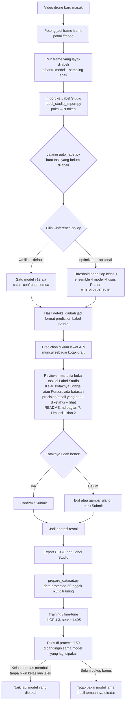

# Alur Kerja dari Awal sampai Akhir

Penjelasan gampangnya gimana proyek ini jalan sehari-hari, langkah demi langkah, plus script mana yang dipakai di tiap langkah (folder `scripts/`).

## Diagram alurnya

**Cara buka diagram ini:**

- **VS Code:** langsung buka preview file ini aja (`Ctrl+Shift+V` / `Cmd+Shift+V`) — versi VS Code yang sekarang udah otomatis bisa render Mermaid, nggak perlu install extension apapun. (Kalau versi VS Code-nya lumayan lama dan diagramnya nggak muncul, baru install extension "Markdown Preview Mermaid Support".)
- **Nggak mau buka VS Code:** copy-paste kode di bawah ke [mermaid.live](https://mermaid.live).
- **Nggak mau browser juga:** buka `report/workflow_diagram.drawio` langsung pakai aplikasi draw.io atau diagrams.net — diagramnya sama persis, tinggal buka aja.
- **GitHub:** langsung kebaca otomatis kalau buka file `.md` ini di GitHub, nggak perlu setting apa-apa.

Bagian di bawah ini sama kayak diagram di atas, cuma lebih detail — ada beberapa hal teknis dan jebakan yang nggak muat digambar.

## 1. Video masuk

Rekaman drone mentah masuk ke server Label Studio (<LABEL_STUDIO_SERVER>), dari 2 sumber:

- 111 video awal (`/data/frames`, sudah diekstrak sebelum project ini dimulai)
- Video baru yang datang belakangan di `/mnt/drone-capture-minio` dan `/mnt/record-output`

## 2. Ekstrak frame — `scripts/extract_frames.py`

- Pakai ffmpeg, 1 frame tiap 5 detik per video (samain rate video lama).
- Disimpan di `/data/frames_new/<nama_folder_video>/frame_NNNNNN.jpg` — sengaja dipisah dari `/data/frames` biar nomor frame nggak tabrakan sama video lama.
- Kalau kepotong di tengah jalan, bisa dilanjut — video yang udah diekstrak nggak diulang.

## 3. Milih frame yang layak dilabeli

**Cuma ~1,7% dari frame mentah yang ada objeknya** — kalau semua dilabeli manual satu-satu, buang-buang waktu annotator.

- Dipakai 2 cara sekaligus: model yang sudah ada nebak frame mana yang kemungkinan ada objek, plus sampel acak (biar nggak kelewat yang model-nya salah tebak, dan ada contoh "kosong" yang dipilih sengaja).
- Hasil: daftar frame kandidat, format `<folder_video>\t<nama_file_frame>\t<alasan/kelas>` dipisah tab.

## 4. Import ke Label Studio — `scripts/label_studio_import.py`

- Ambil daftar kandidat dari langkah 3, bikin 1 task Label Studio per frame lewat REST API (`POST /api/projects/{id}/import`).
- Syarat: frame harus bisa diakses dari folder media Label Studio (`/data/frames` di-symlink ke `~/label-studio/mydata/media/frames`).
- Butuh API token di environment variable `LABEL_STUDIO_API_TOKEN` — detail token & setup ada di dalam script, termasuk catatan soal kebocoran token lama yang harus di-rotate.

## 5. Anotasi manual

Annotator manusia melabeli tiap task lewat tampilan Label Studio — gambar kotak (`rectanglelabels`) buat 6 kelas RGB (Bridge, Car, Motorcycle, Palm_Oil_Fruit, Person, Truck), atau submit kosong kalau frame-nya memang nggak ada objek.

## 6. Export data

Anotasi yang sudah jadi diambil dari Label Studio, 2 cara:

- Query database langsung (tabel `task` JOIN `task_completion`, filter `project_id` — contoh query di field `source` pada `data/dataset_summary.json`)
- API export COCO bawaan (`GET /api/projects/{id}/export?exportType=COCO`) — copy terbaru di `data/annotation_export/`

## 7. `scripts/prepare_dataset.py` — ubah dari COCO/anotasi mentah jadi format YOLO

**Aturan paling penting di langkah ini: set validasi terlindungi (59 task ID) dikeluarkan dari data train/val duluan, sebelum data lain diacak.**

- Ngubah kotak dari Label Studio (persen ukuran gambar) jadi format YOLO (`cx cy w h` dinormalisasi).
- Daftar 59 task ID ada di `protected_val_task_ids.txt` (filenya nggak ikut di folder scripts deliverable ini, tapi dipanggil sama script — daftar ini permanen, nggak pernah diganti).
- Kenapa penting: versi lama (v9) pernah kejadian data validasinya kecampur ke data training, jadi angka yang dilaporkan waktu itu nggak valid (kelihatan bagus padahal cuma "nyontek"). Berkat set terlindungi ini, angka dari v10 dan seterusnya baru bisa dibandingin adil.
- Hasil akhir: folder `images/{train,val,val_protected}` + `labels/{train,val,val_protected}`, plus 2 file YAML (satu buat training biasa dengan val gabungan, satu lagi val-nya cuma 59 data terlindungi buat perbandingan antar versi).

## 8. Training

- YOLOv8, fine-tune dari checkpoint terbaik sebelumnya kalau ada (v12 = fine-tune dari turunan v10; model thermal = training dari dasar YOLOv8n pakai data HIT-UAV).
- **Aturan wajib: cuma boleh di server L40S (<GPU_SERVER>), khusus GPU 3.** GPU 0/1/2 nggak boleh dipakai sama sekali walaupun lagi nganggur.

## 9. Evaluasi pakai data protected-59

**Wajib: `model.val(data=dataset_protected_val.yaml, conf=0.25, plots=True)` — `conf=0.25` dan `plots=True` harus ditulis eksplisit, jangan dibiarkan default.**

- Kalau `conf=` nggak ditulis: ultralytics pakai default yang kerendahan, bikin jumlah "salah deteksi" di confusion matrix keliatan jauh lebih banyak dari kenyataan.
- Kalau `plots=False`: confusion matrix keluar kosong semua (isinya nol), walaupun precision/recall/mAP tetap kehitung bener.
- Semua angka di `report/PROGRESS_REPORT.md` dan confusion matrix di `report/confusion_matrices/` udah ngikutin aturan ini.

## 10. Auto-label task baru — `scripts/auto_label.py`

Jalanin model yang sudah ditraining buat prediksi task di Label Studio, hasilnya dikirim balik sebagai **prediction** (kotak draft yang masih perlu dicek/diedit manusia, BUKAN anotasi final) lewat `POST /api/predictions/` — endpoint resmi yang bikin `total_predictions` di Label Studio ke-update dengan benar.

- Default: model RGB v12 yang lagi dipakai, confidence 0.25.
- Mau pakai checkpoint lain (misal model thermal): tinggal kasih flag `--weights`.
- Detail lengkap ada di dalam script itu sendiri.

**Flag `--inference-policy vanilla|optimized`, default `vanilla`:**

- Kodenya `optimized` ada di `runs/v12_optimized_inference/`, detail lengkap di `report/inference_validation/VALIDATION_REPORT.md`.
- Opsional — kalau flag nggak ditulis, perilakunya persis sama kayak sebelum flag ini ada.
- Perbandingan lengkap: `README.md` bagian 6.
- Dua-duanya (vanilla dan optimized) menghasilkan bentuk data prediction yang sama persis — langkah review di bawah tetap sama aja mau pakai yang mana.

**Waktu ngecek kotak draft (langkah accept/reject di diagram):** kalau itu prediksi kelas **Bridge** atau **Person**, cek dulu README.md bagian 7, Limitasi 1 dan 2, sebelum di-confirm atau ditolak. Ini bukan catatan kaki yang dibaca sekali terus dilupain — ini justru alasan kenapa Limitasi 7 bikin review manusia wajib buat SEMUA prediction, bukan cuma yang kelihatan ragu-ragu.

### Kenapa nggak dibikin auto-submit semua aja, tanpa perlu direview satu-satu?

**Secara teknis bisa — tapi sengaja belum dibikin, karena precision/recall model belum cukup buat dipercaya tanpa dicek manusia.**

- `auto_label.py` tinggal diubah buat langsung bikin annotation final (endpoint annotation Label Studio), bukan cuma ngirim prediction draft kayak sekarang.
- **Precision masih ada salahnya, dan auto-confirm bakal ikut jadiin itu "kebenaran":** Bridge precision cuma **0,667** di conf=0,25 — sekitar **1 dari 3 kotak Bridge yang diprediksi itu salah** (README.md bagian 4). Kalau di-auto-confirm tanpa dicek, sepertiga dari situ jadi anotasi resmi yang salah, dan bisa nyemari data training versi berikutnya — persis jenis masalah yang udah dua kali bikin project ini rugi (bug kebocoran v9, bug tabrakan frame — `report/PROGRESS_REPORT.md` bagian 1.1 dan 1.3).
- **Auto-confirm nggak nolong masalah kelewat deteksi (recall) sama sekali:** recall Person cuma **0,333** di threshold yang sama — sekitar **2 dari 3 orang yang beneran ada di foto nggak pernah kedeteksi model**, jadi nggak ada kotak yang bisa di-auto-confirm buat kasus itu. Auto-submit cuma "meloloskan" kotak yang udah diprediksi, nggak bisa nambahin yang kelewat. Buat pencegahan pencurian, ini risiko yang lebih penting dari salah deteksi.
- **Data yang dites masih kecil** (protected-59, cuma 76 objek total) — angka precision/recall di atas itu perkiraan yang belum tentu presisi berlaku ke semua kasus lapangan (README.md bagian 7, Limitasi 3).

**Jalan tengah yang belum dicoba:** auto-confirm cuma buat kombinasi kelas+confidence yang precision-nya udah kebukti tinggi (misal Car/Motorcycle di confidence tinggi), Bridge/Person tetap wajib direview manual. **Belum diimplementasikan dan belum divalidasi** — kalau mau dicoba, itu perubahan baru yang perlu dites dan dibuktikan dulu, bukan langsung dianggap aman.

**Ngetes policy sebelum dipakai beneran** (di luar alur rutin di atas, tapi bagian dari gimana `optimized` bisa dibilang "sudah teruji"):

- `scripts/build_clean_val_set.py` bikin set data terpisah dari protected-59, khusus buat coba-coba threshold (`eval_sets/clean_236/` — sengaja keluarin protected-59 dengan cocokin nama file + checksum md5, soalnya `images/val` diam-diam sudah termasuk protected-59 — lihat `report/PROGRESS_REPORT.md` bagian 5.1).
- `scripts/test_auto_label_policy.py` — tes otomatis buat `auto_label.py`, nggak butuh internet, ngecek flag `--inference-policy`, threshold, dan susunan ensemble. Jalanin ini tiap habis ngubah script, sebelum dipercaya dipakai.
