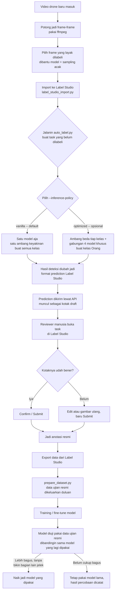

# Alur Kerja — Dari Video Drone sampai Jadi Model yang Dipakai

Dokumen ini jelasin gimana sistem ini jalan sehari-hari, langkah demi langkah, pakai bahasa sesederhana mungkin. Kalau mau lihat ringkasan hasil & cara pakai cepat, buka [README.md](./README.md).

## Diagram Alurnya

Bagian di bawah ini penjelasan tiap kotak di diagram di atas, lebih detail.

---

## 1. Video Drone Masuk

Rekaman drone mentah dari lapangan masuk ke sistem penyimpanan.

## 2. Potong Jadi Frame — `extract_frames.py`

Video dipotong jadi foto-foto diam (screenshot), 1 foto tiap 5 detik, pakai ffmpeg.

## 3. Pilih Frame yang Layak Dilabeli

Cuma sekitar **1,7% dari foto mentah** yang beneran ada objeknya — kalau semua difoto dilabeli manual, buang-buang waktu. Makanya dipakai 2 cara sekaligus:
- Model AI yang udah ada nebak dulu foto mana yang kemungkinan ada objeknya.
- Ditambah sampel acak, supaya nggak kelewat foto yang salah ditebak modelnya, dan tetap ada contoh foto "kosong" yang sengaja dipilih.

## 4. Import ke Label Studio — `label_studio_import.py`

Foto-foto yang kepilih tadi dimasukkan ke sistem pelabelan (Label Studio) lewat API, satu foto jadi satu "task" yang siap dilabeli.

## 5–8. Auto-Label — `auto_label.py`

Ini bagian intinya. Programnya (bukan alat fisik, cuma sekumpulan perintah komputer yang jalan otomatis) ngerjain ini:

1. Login ke sistem penyimpanan foto pakai token akses.
2. Minta daftar foto yang belum ada labelnya.
3. Ambil satu foto, kasih ke model AI buat ditebak isinya.
4. Tebakan itu (posisi kotak + nama objek + seberapa yakin) diubah ke format yang dimengerti sistem.
5. Dikirim balik sebagai **"prediction"** — status ini penting, artinya kotaknya muncul sebagai **draft/usulan**, BUKAN label resmi.
6. Ulangi buat semua foto di daftar, lalu cetak ringkasan di akhir (berapa berhasil, berapa gagal, berapa banyak tiap jenis objek ketemu).

### Dua Cara Nebak: `vanilla` vs `optimized`

| | `vanilla` (default) | `optimized` (opsional) |
|---|---|---|
| Jumlah model dipakai | 1 model | 1 model buat 5 kelas, tapi **4 model digabung** khusus buat kelas Orang |
| Ambang keyakinan | Sama rata semua kelas (0,25) | **Beda-beda tiap kelas**, hasil dari uji coba |
| Perlu training ulang? | Tidak | Tidak — cuma beda cara pakainya |

**Kenapa ambang keyakinannya dibeda-bedain di mode `optimized`?** Ternyata satu standar yang sama buat semua kelas itu nggak optimal. Contohnya: kelas Truk, Jembatan, Motor, dan Buah Sawit ternyata lebih akurat kalau standarnya dinaikin (lebih ketat) — mengurangi salah tebak tanpa bikin yang bener ikut kebuang. Sementara kelas Mobil udah sempurna dari awal, jadi nggak diubah.

**Kenapa kelas Orang dapat perlakuan khusus (4 model digabung)?** Karena masalah utama di kelas Orang bukan "suka salah tebak", tapi "sering kelewat nggak kedeteksi". Jadi dipakai cara voting: 4 versi model dijalankan bareng-bareng buat foto yang sama, dan kalau **minimal 2 dari 4 model itu setuju** ada orang di situ, baru dianggap valid. Keempat model ini walau "keturunan" yang sama, masing-masing belajar dengan cara sedikit beda — jadi mereka nggak selalu kelewat kasus yang sama. Kalau 1 model kelewat lihat orang yang jongkok, kemungkinan model lain masih nangkep. Hasilnya: jumlah orang yang berhasil kedeteksi naik lumayan, tanpa bikin kelas lain jadi lebih jelek. Konsekuensinya: proses ini jadi ~4x lebih berat komputasinya khusus buat bagian Orang.

## 9. Reviewer Manusia Buka Task

Manusia buka Label Studio, lihat kotak-kotak draft tadi satu-satu.

## 10. Kotaknya Udah Bener?

- **Iya** → langsung confirm/submit.
- **Belum** → diedit atau digambar ulang dulu, baru submit.

## 11. Jadi Anotasi Resmi

Baru di titik ini datanya resmi jadi label yang bisa dipercaya dan dipakai buat melatih model berikutnya.

### Kenapa Nggak Langsung Jadi Anotasi Resmi?

Secara teknis bisa aja programnya diubah buat langsung nyimpen tebakan jadi label resmi tanpa nunggu manusia. Tapi ini sengaja nggak dilakukan, karena 2 alasan:

1. **Kalau salah, kesalahannya ikut "disahkan".** Buat kelas Jembatan, dari tiap 3 tebakan, kira-kira 1 itu salah. Kalau langsung disahkan tanpa dicek, data yang salah itu bisa ikut kepakai lagi buat melatih model berikutnya — bikin masalahnya nular ke model generasi selanjutnya.
2. **Masalah yang lebih besar: sering kelewatan, bukan cuma salah tebak.** Buat kelas Orang, dari 3 orang yang beneran ada di foto, sistem cuma berhasil nebak 1. Auto-submit sama sekali nggak nolong ini — dia cuma bisa "mengesahkan" kotak yang udah ada, sedangkan yang kelewat ya tetap kelewat, nggak ada kotak yang bisa disetujui buat kasus itu.

Jadi review manusia bukan formalitas — itu yang mencegah data salah/kurang lengkap ikut jadi "kebenaran resmi" yang dipakai berulang-ulang.

## 12. Export Data dari Label Studio

Data yang udah dilabeli resmi diambil keluar, siap diolah jadi format buat training.

## 13. `prepare_dataset.py` — Ubah ke Format Training

**Aturan paling penting di sini:** ada satu kumpulan foto khusus yang dijadiin "soal ujian resmi" — dikeluarkan dari data latihan **sebelum** data lain diacak dan dibagi. Foto-foto ini dikunci permanen, nggak pernah dipakai buat latihan sama sekali.

Kenapa penting? Karena ini yang bikin pengujian model jadi jujur — model nggak pernah "melihat" soal ujiannya duluan. Detail lebih lengkap soal kenapa ini krusial (termasuk insiden yang pernah kejadian kalau ini dilanggar) ada di README.md bagian batasan.

## 14. Training

Model dilatih (atau dilanjutkan dari model sebelumnya) pakai data latihan yang udah disiapin.

## 15. Model Diuji

Model yang baru dilatih dites pakai "soal ujian resmi" tadi, dibandingin hasilnya sama model yang lagi dipakai sekarang.

## 16. Keputusan Akhir

- Kalau **kelas-kelas prioritas membaik tanpa bikin kelas lain jadi jelek** → model baru naik jadi yang dipakai.
- Kalau **belum cukup bagus** → tetap pakai model lama, hasil percobaannya dicatat sebagai pelajaran buat percobaan berikutnya.
